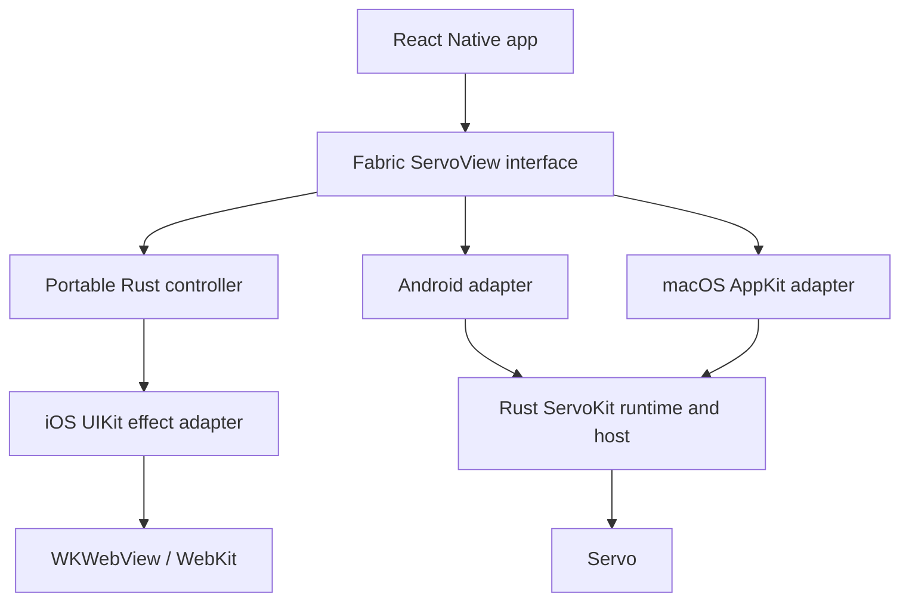

# ServoKit Architecture

ServoKit is a Servo embedding toolkit with Rust-owned controller semantics and
thin platform adapters. React Native exposes one Fabric
`ServoView`; each native adapter maps that interface to its engine. The iOS
path uses the Servo-free portable Rust controller with WKWebView. This is the
fast mental model. Detailed runtime flow and the repo-maintained module map
live in
[`docs/runtime-and-module-map.md`](./docs/runtime-and-module-map.md). The
platform host-control capability matrix lives in
[`docs/host-control-capabilities.md`](./docs/host-control-capabilities.md).

## Project Structure

```text
crates/                         Rust facade, embedder, host, and platform hosts
packages/react-native-servokit/ React Native Fabric adapter
examples/                       Repo-local proof apps and fixtures
docs/                           Durable reference docs
upstream/servo/                 Pinned upstream Servo reference checkout
```

## High-Level System Diagram



## Core Components

| Component | Owns |
| --- | --- |
| `servokit` | Rust facade for native callers: runtime, webview, surface, event, input, and control vocabulary. |
| `servokit-embedder` | Reusable Servo integration, portable controller reducer, command/event payloads, pending control state, and Servo runtime helpers. |
| `servokit-host` | Host-neutral surface and platform values. |
| `servokit-host-android` | Android native-window/render backend, JNI, frame loop, clipboard/input, and Android platform control adapters. |
| `servokit-host-desktop` | Package-private desktop C boundary over the Rust ServoKit runtime for framework adapters. |
| `servokit-controller-ffi` | Servo-free portable controller C boundary packaged for iOS. |
| `crates/servokit-host-android/android` | Shared repo-local Android Gradle/Kotlin/JNI host module below React Native and Android examples. |
| `react-native-servokit` | One `ServoView` Fabric contract plus engine-specific Android, iOS, and macOS adapters. |

## Runtime Paths

```text
Native Rust shells
  -> servokit
  -> servokit-embedder + servokit-host
  -> Servo

React Native Android
  -> react-native-servokit ServoView
  -> crates/servokit-host-android/android
  -> servokit-host-android
  -> servokit-embedder
  -> Servo

Kotlin/native Android examples
  -> crates/servokit-host-android/android
  -> servokit-host-android
  -> servokit-embedder
  -> Servo

React Native iOS
  -> react-native-servokit ServoView
  -> portable Rust controller + UIKit effect adapter
  -> WKWebView/WebKit

React Native macOS
  -> react-native-servokit ServoView
  -> AppKit adapter + package-private desktop C boundary
  -> Rust ServoKit runtime and host
  -> Servo
```

## Ownership Model

- Apps own product UI, tabs, chrome, navigation affordances, and top-level
  windows.
- The shared React Native layer owns the public Fabric `ServoView` props,
  events, mounted command, refs, and JavaScript ergonomics. It does not choose
  one engine implementation for every platform.
- Android and macOS adapters own native views and handles, mounting, geometry,
  input translation, native presentation, and platform scheduling. Rust owns
  controller/browser state and Servo integration behind those adapters.
- On iOS, the portable Rust controller owns shared command validation, request
  identity, pending semantics, and fallback policy. The Objective-C++ adapter
  executes Rust effects and owns its `WKWebView`, WebKit delegates, native
  completions and timers, recycling, KVO/native objects, and main-thread
  scheduling. The packaged Rust controller does not include Servo.
- On Servo-backed paths, surface lifecycle and browser control identity are
  separate. A controller can outlive a render surface; disposing the host
  invalidates later commands explicitly.

## Servo runtime ownership

Servo-backed paths use one process engine and one active owner on its UI thread.
The native Rust `Runtime<SurfaceHost<_>>` can create multiple independent live
webviews under that owner. Each view keeps its own Servo `WebView`, delegate,
controller/pending state, event queue, and rendering target. The host retains the
engine connection independently of its views, including while no views exist.

The runtime manages view membership and handle routing; the application manages
selection, layout, and presentation. Servo owns internal IPC,
networking/storage infrastructure, and engine coordination. Existing
`SessionHandle`s identify logical groups; they do not provide storage partitions.

View destruction and ordinary host disposal preserve the process engine for
reuse. Explicit `Runtime::shutdown` is terminal because Servo 0.3 cannot initialize
twice in one process. The [surface contract](docs/surface-modes.md) defines update
servicing, error attribution, and view/native-resource teardown ordering.

The single-view Android and private desktop adapters retain their existing
ownership paths; this does not introduce a public React Native multi-view API.
Lower-level Rust `PopupRequestPolicy::ManagedChild` remains root-scoped popup
adoption, separate from independently created native views. React Native Android
uses default-deny and emits `onCreateNewWebViewRequested` as informational intent;
iOS does not emit that event.

## Engine-Specific Control Ownership

The React Native API uses shared capability names such as `navigationPolicy`
and `dialog`, but sharing names does not move native engine state across
platforms.

- On Android and macOS, Rust creates and validates Servo-backed commands and
  pending requests; native adapters translate platform input and presentation.
- On iOS, the portable Rust controller validates supported commands and owns
  request identity, pending semantics, and fallback policy. The Objective-C++
  adapter maps its effects and observations to WebKit/UIKit and owns native
  completion and timer objects.
- React Native callbacks provide app-facing presentation and answers. They do
  not replace the owning controller's pending state.

Fallback policy is safe native default first, bounded non-wedging fallback
second, and deny-by-default for risk-sensitive capabilities.

## Platform Posture

| Platform | Current posture |
| --- | --- |
| Android | Servo-backed experimental path through the Rust ServoKit runtime and shared Android host module. |
| iOS | Packaged WKWebView/WebKit-backed React Native `ServoView` above the Servo-free portable Rust controller; Servo-on-iOS is deferred. |
| macOS | Experimental Servo-backed React Native implementation through AppKit and the package-private desktop C boundary; not a supported or distributed runtime contract. |
| Native desktop | Rust facade proof paths for app-owned native windows/layout slots. |
| Windows React Native | Runtime adapter, package integration, and distribution are deferred. |

iOS defaults to WebKit because iOS browser-engine policy, artifact supply, and
entitlements are separate host constraints; see Open Web Advocacy's
[Apple Browser Ban](https://open-web-advocacy.org/apple-browser-ban/) summary
for context. Servo-on-iOS is deferred.

## Development And Validation

Build and runtime evidence for each platform is maintained in the
[readiness matrix](docs/readiness-checks.md).

Fixture pages prove smoke behavior for current proof surfaces. A fixture load is
not by itself a claim that ServoKit owns native defaults, customization hooks, or
complete support for a capability.

## Future Considerations

- Platform-specific host-control implementation claims should stay aligned with
  [`docs/host-control-capabilities.md`](./docs/host-control-capabilities.md).
- Preload/user scripts, secure web-content IPC, accessibility, publication/CI,
  release promotion, and richer platform parity remain separate product
  decisions.

## Documentation Map

| Doc | Use it for |
| --- | --- |
| [`README.md`](./README.md) | Product overview, status, examples, and on-ramp. |
| [`docs/runtime-and-module-map.md`](./docs/runtime-and-module-map.md) | Detailed runtime flow, ownership split, and module map. |
| [`docs/host-control-capabilities.md`](./docs/host-control-capabilities.md) | Android Servo-backed vs iOS WKWebView/WebKit-backed host-control capability matrix. |
| [`docs/servokit.md`](./docs/servokit.md) | Target module responsibilities and design rules. |
| [`docs/surface-modes.md`](./docs/surface-modes.md) | Current native-child and CPU-offscreen surface contract. |
| [`docs/embedded-surface-contract.md`](./docs/embedded-surface-contract.md) | App-owned window and layout embedding contract. |
| [`docs/controller-seam.md`](./docs/controller-seam.md) | Controller identity, command envelope ownership, and response rules. |
| [`docs/react-native-rust-control-seam.md`](./docs/react-native-rust-control-seam.md) | Rust controller-command transports for Servo-backed hosts and the portable iOS controller. |
| [`docs/react-native-servokit.md`](./docs/react-native-servokit.md) | React Native adapter API and platform posture. |
| [`docs/feature-coverage.md`](./docs/feature-coverage.md) | Current capability coverage and deferred surfaces. |
| [`docs/readiness-checks.md`](./docs/readiness-checks.md) | Build and smoke-check matrix. |

## Glossary

- **Servo controller**: Rust-owned command, pending-request, and browser state
  for a Servo-backed host.
- **Engine adapter**: Platform mapping from the shared Fabric interface and its
  Rust control semantics to ServoKit/Servo or WKWebView/WebKit.
- **Port/adapter**: Thin platform binding or view holder around the selected
  engine and its owning control layer.
- **Controller handle**: Rust-owned control identity for commands and policy
  responses; the iOS handle targets the Servo-free portable controller.
- **Render handle**: Servo-backed platform surface/render target identity.
- **Pending control**: In-flight engine request waiting for a valid response or
  fallback.
