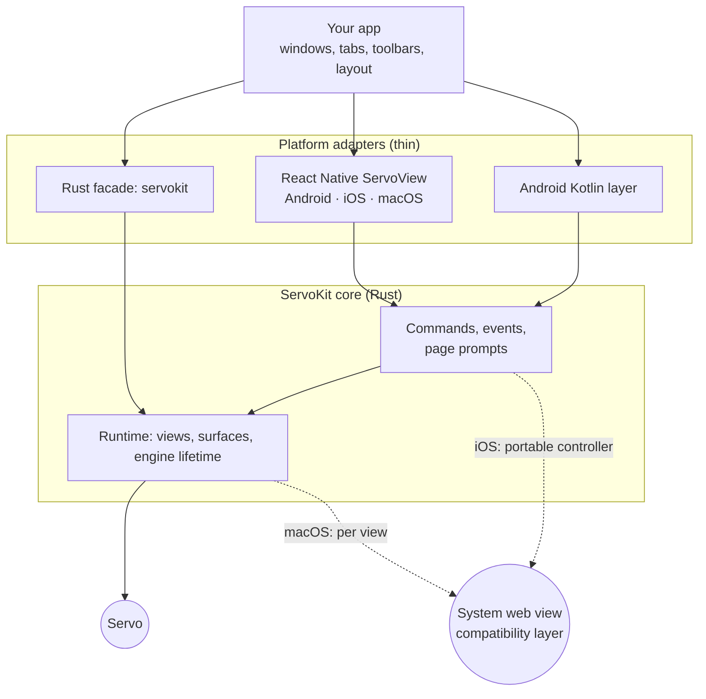

# How ServoKit works

ServoKit sits between your app and Servo, a web engine built for embedding.
Like CEF, it lets your app own everything the user sees around the page. Where
Servo isn't ready yet, a view can run on the platform's own web view through a
compatibility layer, behind the same API. ServoKit's Rust core owns the
browser logic, and a thin adapter on each platform connects it to your app.
This page explains the layers, the rules we keep, and how a request travels
through the code.

## The big picture


```mermaid
flowchart TD
  app["Your app<br/>windows, tabs, toolbars, layout"]
  subgraph adapters["Platform adapters (thin)"]
    rn["React Native ServoView<br/>Android · iOS · macOS"]
    kotlin["Android Kotlin layer"]
    rust["Rust facade: servokit"]
  end
  subgraph core["ServoKit core (Rust)"]
    controller["Commands, events,<br/>page prompts"]
    runtime["Runtime: views, surfaces, engine lifetime"]
  end
  servo(("Servo"))
  webkit(("System web view<br/>compatibility layer"))

  app --> rn
  app --> kotlin
  app --> rust
  rn --> controller
  kotlin --> controller
  rust --> runtime
  controller --> runtime
  runtime --> servo
  runtime -. "macOS: per view" .-> webkit
  controller -. "iOS: portable controller" .-> webkit
```

Servo is the engine. The platform's own web view is a compatibility layer
for what Servo can't do yet. Today, native Rust apps on macOS choose per view,
Android and the other desktop paths use only Servo, and iOS uses only
`WKWebView`, because Apple requires WebKit for most iOS apps and Servo doesn't
support iOS yet. On iOS, the same Rust controller logic drives `WKWebView`.

## The layers

| Layer | Owns | Lives in |
| --- | --- | --- |
| **Your app** | Windows, tabs, menus, toolbars, layout, the event loop, and how prompts look | Your code |
| **Adapter** | Native views and handles, input translation, threads, presenting UI, native completion objects | `packages/react-native-servokit`, `crates/servokit-host-android/android`, `crates/servokit-host-desktop` |
| **Core** | Command names and validation, request IDs, pending prompts, answer checking, web view and surface lifetimes | `crates/servokit-embedder`, `crates/servokit`, `crates/servokit-host` |
| **Engine** | Rendering, networking, storage, and page execution | Servo (crates.io `servo` 0.6.0). The compatibility layer uses the system web view: WebKit on iOS and macOS. |

## Principles

These are the rules the code must follow. A change that breaks one needs an
accepted design decision first.

1. **Your app owns the product.** Windows, tabs, menus, chrome, layout, and the
   event loop belong to the app. ServoKit never opens a top-level window or
   creates tabs. It draws into the window, view, or buffer the app gives it.

2. **Servo first; the system web view is a compatibility layer.** Each web
   view runs on Servo or, where a platform offers the compatibility layer, on
   the platform's own web view. Where both exist (today, native Rust on
   macOS), the app chooses, and ServoKit never switches on its own. The
   compatibility layer lets apps ship while Servo matures; it is not a second
   engine to design for.

3. **Browser logic lives in Rust, once.** Command names, field validation,
   request IDs, pending prompts, and answer checking are written in Rust and
   shared by every platform. Writing them once is what keeps them consistent.
   Known gap: macOS system web views don't pass prompts to the app yet, so
   WebKit's defaults apply.

4. **Adapters stay thin.** Platform code owns only what the platform forces on
   it: views, native handles, input translation, presentation, threads, and
   native completion objects. Adapters carry messages; they don't decide what
   messages mean. Callbacks in React Native or Kotlin supply answers and UI,
   but are never the source of truth for a pending prompt.

5. **One way in for browser control.** Commands and prompt answers travel as
   one versioned JSON envelope, parsed only by `ControllerCommand` in Rust.
   Surfaces, input, and the update loop have their own APIs and stay out of
   the envelope.

6. **A web view outlives its surface.** A web view can exist before, between,
   and after surfaces. Detaching keeps its page and state. Disposing it makes
   later commands fail with an explicit error, never act on a stale object.

7. **No orphaned prompts; deny what's risky.** Every prompt ends with the
   app's answer, or with the engine's own default when nobody handles it or
   the view goes away. ServoKit adds no timers and makes up no answers.
   Risky capabilities, such as permission requests, are denied by default.
   Known gap: the iOS adapter and the React Native adapter on Android still
   add timers or answer on their own; see
   [Fallbacks](docs/concepts/controller.md#fallbacks).

8. **Servo starts once per process.** It runs on one UI thread and cannot
   restart. The host app decides when it shuts down. ServoKit never shuts it
   down on its own.

9. **Servo-first APIs.** Design every public API for Servo first. No feature
   may exist only in the compatibility layer; where the system web view can't
   do something, it returns an explicit unsupported error instead of faking
   it. Build on Servo's published crates.io release, use Servo's names for
   Servo concepts, and follow servoshell's embedding patterns. Diverge only on
   purpose, and say why.

10. **Claim only what's proven.** A capability counts as supported only when
    there is evidence for it in [Testing and validation](docs/reference/testing.md).
    [What works where](docs/reference/capabilities.md) is the single source of
    truth for support claims.

## Paths through the code

```text
Native Rust app
  → servokit (Runtime, SurfaceHost or MacOsViewHost)
  → servokit-embedder + servokit-host
  → Servo  (or WebKit, for a macOS system view)

React Native on Android
  → react-native-servokit (ServoView.kt)
  → Android Gradle module (ServoViewBinding, JNI)
  → servokit-host-android
  → servokit-embedder
  → Servo

Kotlin app on Android
  → Android Gradle module (ServoViewBinding, JNI)
  → servokit-host-android
  → servokit-embedder
  → Servo

React Native on iOS
  → react-native-servokit (ServoView.mm)
  → servokit-controller-ffi (portable controller, no Servo)
  → effects applied to WKWebView

React Native on macOS (prototype)
  → react-native-servokit (macos/ServoView.mm)
  → servokit-host-desktop (private C boundary)
  → servokit + servokit-embedder
  → Servo
```

React Native defines one `<ServoView>` with one set of props, events, and
commands. Each platform maps it to its engine. React Native is one adapter
among several, not the center of the design: the Android Kotlin layer is
shared by the React Native adapter and the plain Kotlin examples.

## A request, end to end

Here is what happens when a page calls `confirm("Delete?")` inside a React
Native app on Android:

1. Servo calls ServoKit's `WebViewDelegate` with a dialog request.
2. Rust records a pending dialog with a new ID, such as `dialog-1`, and queues
   a `simpleDialogRequested` event.
3. On the next frame, the Kotlin adapter drains events and sends
   `onJavaScriptDialogRequested` to JavaScript.
4. Your `onJavaScriptDialog` handler shows a dialog and calls
   `request.confirm()`.
5. The component sends
   `{"version":1,"command":"resolveSimpleDialog","dialogId":"dialog-1","confirmed":true,"promptValue":null}`
   to the native view, which passes it through JNI unchanged.
6. Rust parses the envelope, checks that `dialog-1` is still pending on this
   view, and answers Servo. The page's `confirm()` returns `true`.

If there is no handler, step 4 shows a native Android dialog instead, and its
answer takes the same path from step 5. On iOS, steps 1 to 3 start from a
WebKit callback, and in step 6 the Rust controller tells Objective-C++ which
stored WebKit completion handler to call.

## Repository map

```text
crates/                          Rust crates (one Cargo workspace)
  servokit/                      Public Rust API for native apps
  servokit-embedder/             Shared core and Servo integration
  servokit-host/                 Host-neutral surface types
  servokit-host-android/         Android host (Rust) and its Gradle module
  servokit-host-desktop/         Private C boundary for React Native macOS
  servokit-controller-ffi/       Servo-free controller for iOS
packages/react-native-servokit/  The React Native package
examples/                        Example apps and shared test pages
docs/                            Documentation
distribution/                    Scripts that build the iOS and macOS binaries
patches/, crates/vendor/         Temporary dependency patches
upstream/servo/                  Pinned Servo source, for reference only
```

Each crate's job and dependency rules are in
[Crates and packages](docs/reference/crates.md).

## Where to go next

| To learn about | Read |
| --- | --- |
| The engine, web views, threads, and profiles | [Runtime and views](docs/concepts/runtime.md) |
| Drawing into windows, views, and buffers | [Surfaces](docs/concepts/surfaces.md) |
| Commands, events, prompts, and fallbacks | [Commands, events, and page prompts](docs/concepts/controller.md) |
| Each crate's job and dependency rules | [Crates and packages](docs/reference/crates.md) |
| Support on each platform | [What works where](docs/reference/capabilities.md) |

## Glossary

| Term | Meaning |
| --- | --- |
| **Web view** | One browsing context: a page, its history, and its pending prompts. Identified by a `WebViewHandle`. |
| **Surface** | Where a web view draws: a native window or view, or an offscreen buffer. |
| **Runtime** | The Rust object that owns web views and routes commands and events. |
| **Host** | The platform implementation behind a runtime, such as `SurfaceHost` on desktop or the Android host. |
| **Adapter** | Platform code that connects an app framework to the core, such as the React Native view on Android. |
| **Controller** | The Rust code that owns commands, request IDs, and pending prompts for one web view. |
| **Portable controller** | The Servo-free controller used on iOS, built from `servokit-embedder` without the `servo` feature. |
| **Page prompt** | A question the page asks the app: navigation policy, dialogs, menus, pickers, permissions. Servo calls many of these *embedder controls*. |
| **Compatibility layer** | The platform's own web view (WebKit on iOS and macOS), used behind the same API where Servo isn't ready yet. |
| **Command envelope** | The JSON object `{"version":1,"command":...}` that carries commands and prompt answers into Rust. |
| **Event bridge** | The structured JSON stream that carries events out of Rust to adapters. |
