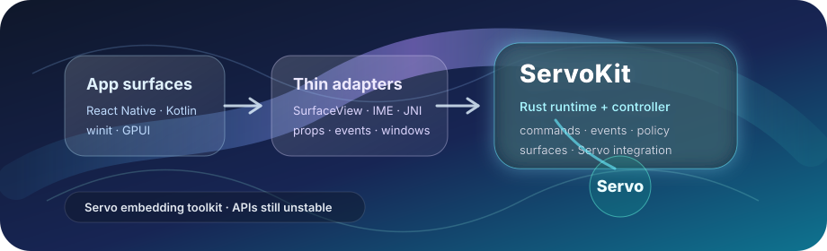

<p align="center">
  
</p>

<h1 align="center">ServoKit</h1>

<p align="center">
  <strong>A reusable Rust runtime and thin-adapter toolkit for embedding Servo.</strong>
</p>

<p align="center">
  App-owned native UI · Rust-owned browser semantics · Servo-powered rendering
</p>

<p align="center">
  <a href="#status-at-a-glance"></a>
  <a href="#what-is-servokit"></a>
  <a href="#status-at-a-glance"></a>
  <a href="./LICENSE"></a>
</p>

<p align="center">
  <a href="./docs/servokit.md">ServoKit docs</a> ·
  <a href="./ARCHITECTURE.md">Architecture</a> ·
  <a href="./docs/react-native-servokit.md">React Native adapter</a> ·
  <a href="./docs/development.md">Development</a> ·
  <a href="./docs/readiness-checks.md">Readiness checks</a> ·
  <a href="./examples">Examples</a>
</p>

> [!IMPORTANT]
> ServoKit and its APIs are experimental. No npm release exists yet; the current local package baseline includes Android and iOS, while Servo-on-iOS and publication remain deferred.

## Status at a glance

| Area | Current stance |
| --- | --- |
| API stability | Experimental; APIs and packaging may change. |
| Best current Servo-backed validation path | React Native Android proof build, with Android/native and desktop examples validating shared ServoKit layers. |
| Distribution | No npm release yet. The exact local package carries prebuilt Android and iOS native dependencies; consumer builds run neither Cargo nor native downloads and do not reference this workspace. |
| iOS | Packaged React Native `ServoView` backed by WKWebView/WebKit above a Servo-free portable Rust controller. CocoaPods autolinking and Release builds are proven for device arm64 and simulator arm64/x86_64. The current baseline also passed one attended ARM64 simulator run; each future candidate still needs its own manual runtime gate. Servo-on-iOS is deferred. |
| React Native macOS | Experimental AppKit/private-C/Rust implementation; not a supported or distributed runtime contract. |
| React Native Windows | Runtime adapter and distribution are deferred. |
| Deferred support | No secure IPC bridge, preload/user-script system, or accessibility support is claimed yet. |
| Servo runtime lifecycle | One live root/lease per process. Dropping or destroying its owning webview/host releases the lease; a later root reuses the retained UI-thread process runtime. Surface detach does not release it. |
| Popup/new-window | Lower-level Rust ServoKit supports root-scoped managed children. React Native Android remains default-deny and emits informational `onCreateNewWebViewRequested` intent only; iOS does not emit it. See [Architecture](./ARCHITECTURE.md#current-servo-runtime-limit). |

## What is ServoKit?

Apps that want Servo-powered web content inside native UI should not need to
rebuild controller, surface, and embedder-control glue for each host. ServoKit
packages servoshell-like embedding patterns into reusable Rust crates and thin
host adapters so native shells, React Native Android, Android/Kotlin examples,
and desktop proofs can share a browser/runtime foundation while owning their
own layout and chrome.

The durable split follows ownership. Rust owns browser/controller semantics on
Servo-backed paths and portable command, request, fallback, and response
semantics on iOS. Host adapters own platform ergonomics, engine handles, and
unavoidable native glue. Start with
[`ARCHITECTURE.md`](./ARCHITECTURE.md) for the fast system model.

If CEF is your mental model, think of ServoKit as a much narrower, experimental
Servo embedding layer: reusable engine/control/surface glue for repo-local
proofs, not a Chromium-scale SDK or production distribution.

## Who this is for

ServoKit is currently most useful for:

- Servo and browser-engine contributors who want reusable embedding seams to
  validate upstream Servo behavior.
- Rust and native app-shell developers exploring app-owned UI with
  Servo-powered web content.
- Teams evaluating whether Servo can become an embeddable engine in their
  longer-term architecture.

It is not for developers who need a drop-in production WebView, stable mobile
SDK, published binary distribution, Servo-on-iOS support, or automatic
alternatives to Apple's WebKit-backed iOS browser policy today.

## Try the current proof builds

The shortest Servo-backed repo-local proof path is the React Native Android
build. See [`docs/readiness-checks.md`](./docs/readiness-checks.md) for its
prerequisites and validation boundaries, then run this from the repository
root:

```sh
bun install
bun run --cwd packages/react-native-servokit typecheck
bun run --cwd packages/react-native-servokit prepare
bun run --cwd examples/react-native-app build:android
```

Expected result: TypeScript and package builds pass, then the React Native
Android example assembles against the package-local AAR. That AAR contains
`arm64-v8a` and `x86_64`; the app's normal React Native build configuration
selects its target architecture. Device or emulator smoke is a separate manual
step; when one is attached, use the commands and expected fixture behavior in
[`docs/readiness-checks.md`](./docs/readiness-checks.md).

From `packages/react-native-servokit`, the exact iOS package matrix is:

```sh
node scripts/validate-packed-consumer.mjs --ios-only
```

It packs the local package, installs that exact tgz in a clean external React
Native consumer, and proves Release builds for device arm64, simulator arm64,
and simulator x86_64. It does not perform the separate simulator runtime smoke.
Servo-on-iOS remains deferred.

## Architecture

[`ARCHITECTURE.md`](./ARCHITECTURE.md) is the canonical system model.
[`docs/runtime-and-module-map.md`](./docs/runtime-and-module-map.md) has the
detailed runtime flow and module map.

## Examples and status

| Surface | Status | Purpose | Start here |
| --- | --- | --- | --- |
| React Native Android | Experimental | Fabric `ServoView` adapter backed by ServoKit's Rust runtime and shared Android host path | [`examples/react-native-app`](./examples/react-native-app), [`docs/react-native-servokit.md`](./docs/react-native-servokit.md) |
| React Native iOS | Experimental local package | Shared `ServoView` maps portable Rust controller effects to WKWebView/WebKit; the exact package Release matrix and current attended runtime baseline pass, while Servo-on-iOS is deferred | [`docs/react-native-servokit.md`](./docs/react-native-servokit.md) |
| React Native macOS | Experimental, not supported | Exercises the shared Fabric surface through AppKit and the private desktop C boundary into Rust ServoKit; no runtime or distribution contract is claimed | [`examples/react-native-macos-app`](./examples/react-native-macos-app), [`docs/react-native-servokit.md`](./docs/react-native-servokit.md) |
| Native Android proof app | Experimental proof | Android `SurfaceView` host path without React Native; shared controller, events, and fallback UI seams | [`examples/android-native-example`](./examples/android-native-example) |
| Kotlin Android browser | Experimental example | App-facing Kotlin browser chrome over the same shared Android host/control coordinator; not a stable Kotlin SDK or AAR | [`examples/android-kotlin-browser`](./examples/android-kotlin-browser) |
| Desktop `winit` | Prototype | App-owned event loop/window, basic input, and Servo-backed rendering through the Rust facade | [`examples/desktop-winit`](./examples/desktop-winit), [`docs/desktop-winit.md`](./docs/desktop-winit.md) |
| Desktop GPUI | Prototype | GPUI-owned layout slot over the `servokit` facade; not a production component crate | [`examples/desktop-gpui`](./examples/desktop-gpui) |

## React Native adapter naming

The React Native adapter for ServoKit lives in
[`packages/react-native-servokit`](./packages/react-native-servokit) and is imported as
`react-native-servokit`.

## Documentation

Curated entry points. [`ARCHITECTURE.md`](./ARCHITECTURE.md) is the architecture
front door.

| Doc | Use it for |
| --- | --- |
| [`ARCHITECTURE.md`](./ARCHITECTURE.md) | Canonical architecture front door and fast system mental model |
| [`docs/development.md`](./docs/development.md) | Change ownership, anti-churn rules, and narrow validation routing |
| [`docs/servokit.md`](./docs/servokit.md) | Target ServoKit module responsibilities and design rules |
| [`docs/react-native-servokit.md`](./docs/react-native-servokit.md) | React Native adapter API, Android Servo-backed status, iOS WKWebView path, deferred Servo-on-iOS work, and host boundary |
| [`docs/readiness-checks.md`](./docs/readiness-checks.md) | Build and smoke-check matrix for repo-local proof surfaces |
| [`docs/feature-coverage.md`](./docs/feature-coverage.md) | Current embedder-control coverage and deferred features |
| [GitHub Wiki](https://github.com/KeplerBrowser/ServoKit/wiki) | Project workflow, integration recipes, and troubleshooting; repository documentation remains canonical |

## Contributing

Use [`docs/development.md`](./docs/development.md) before changing code or docs.
It routes each change to the owning layer and the narrowest useful validation
check.

## License

MIT
