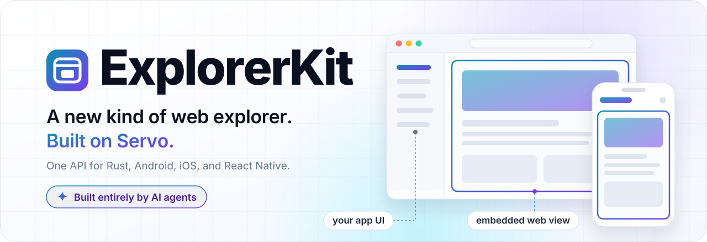

<p align="center">
  <picture>
    <source media="(prefers-color-scheme: dark)" srcset="docs/assets/banner-dark.svg">
    
  </picture>
</p>

<p align="center">
  <a href="#status"></a>
  <a href="https://crates.io/crates/servo"></a>
  <a href="#built-by-ai-agents"></a>
  <a href="LICENSE"></a>
</p>

<p align="center">
  <a href="docs/getting-started.md"><b>Get started</b></a> ·
  <a href="docs/README.md"><b>Docs</b></a> ·
  <a href="ARCHITECTURE.md"><b>How it works</b></a> ·
  <a href="CONTRIBUTING.md"><b>Contribute</b></a>
</p>

**ServoKit puts [Servo](https://servo.org), the independent web engine built
for embedding, inside your app. Where Servo isn't ready yet, a view can use
the platform's own web view instead, behind the same API.**

You build the app: its windows, tabs, and buttons. ServoKit runs the engine,
draws web pages into a view you own, and gives you one small API to control it
from Rust, Kotlin, or React Native.

If you know [CEF](https://github.com/chromiumembedded/cef), it's the same
idea, built on Servo. Servo can't render every website yet, so ServoKit also
has a compatibility layer that runs a view on the system web view. Views move
to Servo as it matures.

## Why ServoKit

- **Your app stays yours.** ServoKit never opens windows or adds browser
  chrome. It draws into the window or view you give it.
- **Servo first, with a way out.** Build for Servo, and run a view on the
  system web view where Servo isn't ready yet, behind the same API.
- **Browser logic is written once.** Navigation rules, dialogs, and other page
  requests are handled in Rust, not rewritten per platform. This covers Servo
  views and iOS; macOS system web views still use WebKit's defaults.
- **Platform code stays thin.** Each platform adapter does only what the
  platform requires: views, input, and threads.
- **One API across platforms.** React Native apps get one `<ServoView>`. Rust
  apps get one `Runtime`.

## Where it runs

| Platform | Engine today | Status |
| --- | --- | --- |
| macOS: Rust | Servo or the system web view, per view | 🧪 Experimental |
| Android: Kotlin or React Native | Servo | 🧪 Experimental |
| iOS: React Native | System web view (WebKit)¹ | 🧪 Experimental |
| macOS: React Native | Servo | 🔬 Prototype, not supported |
| Windows and Linux: Rust | Servo | 🚧 Should build; not verified yet |

¹ Apple requires WebKit for most iOS apps, and Servo doesn't support iOS
yet. On iOS, ServoKit keeps the same `<ServoView>` API and the same Rust
browser logic, and drives `WKWebView` underneath.

On macOS, which should you use? Servo works best today for content you
control. For arbitrary websites, the system web view is the safer choice for
now.

See [what works where](docs/reference/capabilities.md) for the full feature list.

## Quick look

**React Native**

```tsx
import { ServoView } from 'react-native-servokit';

export function Browser() {
  return (
    <ServoView
      style={{ flex: 1 }}
      url="https://servo.org"
      onPageTitleChanged={(e) => console.log(e.nativeEvent.title)}
      onShouldStartLoadWithRequest={({ url }) => !url.includes('blocked')}
    />
  );
}
```

**Rust**

```rust
use servokit::{surface::SurfaceHost, HostEvent, HostSurface, Runtime};

// `surfaces` gives ServoKit your window's native handle (see examples/desktop-winit).
let mut runtime = Runtime::new(SurfaceHost::new(surfaces, options));
let session = runtime.create_session();
let view = runtime.create_webview(session)?;
runtime.load_url(view, "https://servo.org")?;
runtime.attach_surface_with_viewport(view, HostSurface::new("main"), viewport)?;

// Call these from your event loop.
runtime.perform_updates(view)?;
for event in runtime.drain_events() {
    if let HostEvent::PageTitleChanged { title } = event.event {
        println!("title: {title:?}");
    }
}
```

## Try it

The fastest path is the iOS simulator, because it needs no Rust toolchain:

```sh
bun install
(cd examples/react-native-app && bundle install)
bun run --cwd examples/react-native-app pods:ios
bun run --cwd examples/react-native-app ios
```

To see Servo itself render, run the desktop example on a Mac
(it compiles Servo, so the first build takes a while):

```sh
cargo run --locked --manifest-path examples/desktop-winit/Cargo.toml -- https://servo.org
```

Android and the other examples are covered in [Get started](docs/getting-started.md).

## Built by AI agents

ServoKit is built agent-first. So far, AI coding agents have written, tested,
reviewed, and merged every change, and people have steered: they choose what
to build and approve each plan. Every commit so far was co-authored by an AI
agent.

A typical change goes like this:

1. A contributor opens an issue with a problem or an idea.
2. Maintainers agree on the scope and on how to prove it works.
3. A contributor asks an AI agent to build it, and the agent builds and
   tests it.
4. A second agent reviews it.
5. The agent merges it once the checks pass.

This is the project's working style, not a requirement for contributors.
Issues, ideas, and discussion are all welcome, and none of them need code.
The rules the agents follow are public:

- [AGENTS.md](AGENTS.md): the rules every agent follows.
- [.agents/skills/development](.agents/skills/development/SKILL.md): playbooks
  for building, reviewing, and merging a change.
- [CONTRIBUTING.md](CONTRIBUTING.md): how people steer the work.

## Docs

| Page | What you'll find |
| --- | --- |
| [Get started](docs/getting-started.md) | Build and run an example app |
| [How it works](ARCHITECTURE.md) | The big picture: who owns what, and the rules we keep |
| [React Native](docs/platforms/react-native.md) | `<ServoView>` props, events, and methods |
| [Android](docs/platforms/android.md) | Build the Android engine and use it from Kotlin |
| [Desktop (Rust)](docs/platforms/desktop.md) | Embed Servo in a winit or GPUI app |
| [What works where](docs/reference/capabilities.md) | Feature support on each platform |

Browse [all docs](docs/README.md). AI agents can start from [llms.txt](llms.txt).

## Status

ServoKit is an experiment. APIs change often, and nothing is published to npm
or crates.io yet. Servo itself can't render every website yet, which is why the
system web view is part of the design. These are not supported yet: messaging
between web pages and native code, preload scripts, and accessibility.

## Credits

ServoKit is glue. The hard parts come from these projects:

- [Servo](https://servo.org): the web engine.
- [WRY](https://github.com/tauri-apps/wry): drives the system web view on
  macOS.
- [surfman](https://github.com/servo/surfman) and
  [raw-window-handle](https://github.com/rust-windowing/raw-window-handle):
  GPU surfaces and native window handles.
- [React Native](https://reactnative.dev): the `<ServoView>` component.
- [winit](https://github.com/rust-windowing/winit) and
  [GPUI](https://www.gpui.rs): used by the desktop examples.

ServoKit is an independent community project, not affiliated with the Servo
project. Licenses are listed in
[Dependencies](docs/reference/dependencies.md#licenses).

## License

ServoKit's own code is [MIT](LICENSE). Dependencies keep their own licenses.
