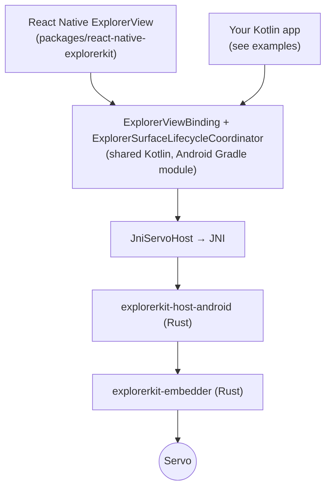

# Android

On Android, ExplorerKit runs Servo inside an ordinary Android `SurfaceView`. You
can use it from React Native, from Kotlin, or from the Rust host directly.
This page covers how the Android pieces fit together, how to build them, and
the Android-specific behavior.

> [!NOTE]
> The Kotlin layer is shared by the React Native adapter and the Kotlin
> examples. It is not a stable Kotlin SDK yet, and there is no published AAR.

## How it fits together



Each frame works like this:

1. Your view owns a `SurfaceView` and passes surface created, resized, and
   destroyed callbacks to `ExplorerSurfaceLifecycleCoordinator`.
2. The coordinator attaches the surface through `ExplorerViewBinding`. Rust
   turns the `Surface` into an `ANativeWindow`, creates a Servo rendering
   context, and builds the web view.
3. On every `Choreographer` frame, your view calls
   `ExplorerViewBinding.performUpdates()`. Rust runs Servo, paints, and queues
   events.
4. Every binding call returns the new events as a list of `ExplorerHostEvent`s,
   decoded from Rust's event bridge by `ExplorerHostEventBridge`.
5. Your view turns those events into UI updates, or into React Native events.

Touch input goes straight from Android `MotionEvent`s into Rust. Browser
commands and prompt answers go through the Rust controller.

The Android host follows Servo's own mobile defaults: it turns on viewport
`<meta>` handling and passes the display density as the page scale, so pages
render at phone size instead of desktop size.

## Build the host library

The host library is Rust code compiled for Android and packaged as an AAR.
Apps that install `react-native-explorerkit` from a package archive get the AAR
prebuilt and need none of this. You need it to build from source.

Requirements:

| Item | Version |
| --- | --- |
| Rust targets | `aarch64-linux-android`, `x86_64-linux-android` |
| `cargo-ndk` | Any recent version |
| Android NDK | `28.2.13676358` for the host library, as set in `crates/explorerkit-host-android/android/build.gradle` |
| JDK | 17 exactly (newer versions are rejected) |
| Servo code generation | `uv`, or Python 3.11 or newer |

Tested with Gradle 9.3.1, Android Gradle Plugin 8.12.0, and Kotlin 2.1.20,
targeting Java 17 bytecode. Builds are tested on macOS. The Windows NDK paths
are configured but not tested end to end.

The Gradle module checks the toolchain up front and fails early, with a
message, unless it finds Gradle 8.13 or newer, AGP 8.9.1 or newer, and exactly
JDK 17. It also fails if Cargo, `cargo-ndk`, `rustup`, or a Rust target is
missing, or if the NDK toolchain can't be found.

What the build does:

1. `cargo ndk` builds `explorerkit-host-android` for `arm64-v8a` and `x86_64`.
2. Gradle packages `libexplorerkit_host_android.so`, `libc++_shared.so`, and the
   Kotlin layer into one release AAR.
3. `verifyExplorerKitAndroidReleaseAar` checks the AAR's exact layout and native
   libraries.
4. `stageReactNativeExplorerKitReleaseAar` runs the check, then copies the AAR
   into `packages/react-native-explorerkit/android/libs/`.

```sh
examples/react-native-app/android/gradlew \
  -p examples/react-native-app/android \
  :explorerkit-host-android:stageReactNativeExplorerKitReleaseAar
```

| Item | Value |
| --- | --- |
| ABIs | `arm64-v8a`, `x86_64` |
| Minimum API level | 24 (`minSdkVersion`) |
| Compile SDK | 36, enforced through the AAR's `minCompileSdk` |
| Target SDK | Chosen by your app (the examples use 36) |

Your app chooses which ABIs to ship through its normal React Native or Gradle
settings. The package adds no ABI filter of its own. The repository's example
apps build `arm64-v8a` only.

> [!IMPORTANT]
> The example apps set `ndkVersion = "27.1.12297006"` for their own native
> code, while the host library needs `28.2.13676358`. Install both NDKs to
> build the examples from source.

## Use it from Kotlin

The Gradle module at `crates/explorerkit-host-android/android` provides:

| Class | Role |
| --- | --- |
| `ExplorerViewBinding` | One browser instance. Commands (`loadUrl`, `reload`, `goBack`, `goForward`, `focus`, `blur`), surface calls (`attachSurface`, `resizeSurface`, `detachSurface`), input (`dispatchTouchEvent`, `dispatchImeComposition`, `dispatchKeyboardKey`, `dismissInputMethod`, `triggerContextMenu`), prompt answers (`resolveSimpleDialog`, `resolveNavigationRequest`, `resolveSelectElement`, `resolveFilePicker`, `dismissFilePicker`, `resolvePermission`, `resolveContextMenu`, `dismissContextMenu`), `performUpdates()`, and `dispose()`. Most calls return the events produced since the last call. `sendControllerCommand(json)` sends a [command envelope](../concepts/controller.md#the-command-envelope) and returns a status code. |
| `ExplorerSurfaceLifecycleCoordinator` | Tracks the `SurfaceView` lifecycle, ignores zero-size surfaces, and holds a URL until a surface exists. |
| `ExplorerHostEvent` | Typed Kotlin events, such as `UrlChanged`, `NavigationRequested`, or `SelectElementRequested`. |
| `ExplorerInputPickerValues` | Parses and formats values for date, time, color, month, and week pickers. |
| `JniServoHost` | The JNI wrapper. Loads the native library. |

Your app answers every page prompt. In particular, each `NavigationRequested`
event waits in Rust until you call `resolveNavigationRequest`.

[`examples/android-native-example`](../../examples/android-native-example/README.md)
is a complete Kotlin app with native UI for every prompt type.
[`examples/android-kotlin-browser`](../../examples/android-kotlin-browser/README.md)
builds the same code under a different name. Both build the Rust library from
source as part of their Gradle build.

## Android behavior

### Prompts and native UI

The shared Android host shows no UI of its own. It reports each prompt as a
`ExplorerHostEvent`, and your app answers through `ExplorerViewBinding`.

The React Native adapter adds native UI: dialogs when your JavaScript has no
`onJavaScriptDialog` handler, and always for context menus, select menus,
date, time, and color pickers, the system file picker, and permission prompts,
which have no JavaScript hooks yet. Kotlin apps build their own UI;
`android-native-example` shows how. Either way, answers go back through Rust,
which checks them. See [What works where](../reference/capabilities.md) for
the details of each.

### Keyboard (IME)

ExplorerKit keeps keyboard input close to upstream Servo's behavior: Android's
`InputMethodManager` shows the soft keyboard, text composition goes to Servo,
and the page is resized when the keyboard appears. App-level layout tools can
adjust the surrounding UI, but text editing inside the page depends on this
native bridge. There is no custom IME API yet.

### Clipboard

Servo's default Android clipboard only stores text inside the process.
ExplorerKit replaces it with Android's real `ClipboardManager`, so cut, copy,
paste, and select all work with other apps.

Android 10 and newer block clipboard reads from apps in the background, so a
paste while your app is in the background gets empty text. ExplorerKit keeps a
cached copy of the clipboard text, updated on every read and write, but uses
it only when a read fails. An empty read overwrites it, so the cache doesn't
help here yet.

### Back button

When a web view has focus, the back button first closes the keyboard. If the
keyboard is closed and the page can go back, it goes back in page history.

## Why there is native code on Android

Desktop Rust apps can be almost pure Rust, because crates like `winit`,
`raw-window-handle`, and `surfman` hide most platform APIs. Android cannot.
The platform requires real framework code for activity and view lifecycle,
`Surface` ownership, IME and `InputConnection`, permissions, intents, and
document pickers. That is why ExplorerKit keeps a Kotlin layer even though the
engine runs in Rust.

## Testing

See [Testing and validation](../reference/testing.md#android).
