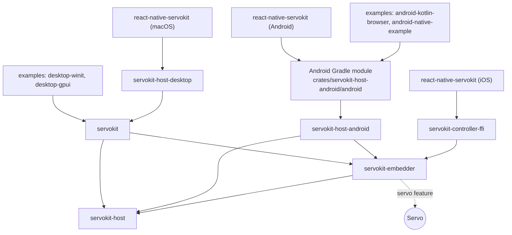

# Crates and packages

This page lists every ServoKit crate and package: what it is for, what it must
not contain, and what depends on what. Use it to decide where a change
belongs.

## Dependency map

Rules for this graph:

- `servokit-host` depends on no other ServoKit crate.
- Nothing depends back up on `servokit` except desktop hosts and apps.
- Servo is only reachable through the `servo` feature. `servokit-controller-ffi`
  never turns it on.
- Do not add crates named `servokit-core`, `servokit-protocol`, or
  `servokit-jni` unless an accepted decision changes this map.

## Rust crates

All crates live in `crates/` and build from `crates/Cargo.toml`.

| Crate | Purpose | Must not contain |
| --- | --- | --- |
| `servokit` | The public Rust API for native apps: `runtime`, `webview`, `surface`, `controls`, `events`, `input`, and `host` modules, plus a few common types at the root. With the `servo` feature it also provides `SurfaceHost` and, on macOS, the AppKit host. The `macos-system-webview` feature adds the system web view host, `MacOsViewHost`. | React Native code, Android framework objects, generated bindings, blanket re-exports of internal crates, or `winit`, GPUI, or raw Servo rendering types in its public API |
| `servokit-embedder` | The shared core: `Runtime`, the command parser, events and the event bridge, page prompt state, the portable controller, and (with `servo`) the Servo engine, web view, and delegate integration | Android lifecycle, React Native ergonomics, generated bindings, or platform UI |
| `servokit-host` | Host-neutral surface types: `HostSurface`, `SurfaceViewport`, `NativeSurface`, `OffscreenSurface`, `SurfaceTarget`, `SurfaceDelegate`, and friends | Platform implementations, JNI, React Native APIs, Servo internals, or a dependency on `servokit-embedder` |
| `servokit-host-android` | The Android host: `ANativeWindow` rendering, frame updates, IME, clipboard, permission and picker requests, and the JNI and C entry points. Builds `libservokit_host_android.so`. Its Gradle module holds the shared Kotlin layer, which shows no UI. | The public Rust API or React Native APIs |
| `servokit-host-desktop` | A private C boundary that lets the React Native macOS adapter create, attach, command, update, drain, and destroy a Rust-owned Servo host | View ownership, React Native APIs, or any stable ABI promise |
| `servokit-controller-ffi` | The Servo-free portable controller behind a four-function C boundary, packaged for iOS | Servo, platform views, WebKit objects, or a stable public ABI |

`servokit` is meant to be the only crate a native Rust app imports. Every
re-export is part of its public contract, so avoid `pub use internal::*`.

Prompt payloads that mirror Servo's delegate API (dialogs, navigation policy,
permissions, select elements) are defined once in `servokit-embedder`, and
`servokit::controls` re-exports them. Keep one definition of each type.

`servokit-host-android` stays separate from `servokit-host` because JNI,
`ANativeWindow`, `cdylib` packaging, and Android lifecycle are heavy
platform details. Move shared host-neutral pieces down into `servokit-host`
instead of moving Android code up.

The `servokit` API is stable enough for this repository's examples, but it is
not a semver-stable SDK yet.

## Where Servo integration lives

| File | What it does |
| --- | --- |
| `servokit-embedder/src/runtime.rs` | `Runtime`: view membership, attach, resize, detach, commands, input, updates, and events, without any windowing toolkit |
| `servokit-embedder/src/servo_webview.rs` | Wraps Servo's `WebViewBuilder` and `WebView`: scale, resize, commands, input, `Servo::spin_event_loop`, paint, and present. Also owns the one-per-process engine. |
| `servokit-embedder/src/servo_webview_adapter.rs` | Implements Servo's `WebViewDelegate`, and keeps pending prompt state |
| `servokit-embedder/src/servo_adapter.rs` | Servo-free state for translating delegate calls into ServoKit events |
| `servokit/src/surface_host.rs` | `SurfaceHost`: Servo rendering contexts for native and offscreen targets |
| `servokit/src/surface/macos/exportable.rs` | The macOS exportable `RenderingContext` and its IOSurface pool |
| `servokit/src/webview/macos.rs` | `MacOsViewHost`: Servo or system WebKit per view |
| `servokit-host-android/src/android_backend.rs` | Android rendering context, clipboard, and platform services |

The Servo APIs ServoKit builds on:

- `WebViewBuilder::new(&servo, Rc<dyn RenderingContext>)`, with `.delegate`,
  `.clipboard_delegate`, `.url`, and `.hidpi_scale_factor`. Servo renders into
  a context the embedder provides, not into a window of its own.
- `WebView::load`, `reload`, `go_back`, `go_forward`, `focus`, `blur`,
  `resize`, `notify_input_event`, and `paint`.
- `Servo::spin_event_loop`, which the host calls from its own loop.
- `WebViewDelegate`: frame-ready, URL, title, favicon, status, load, history,
  focus, cursor, fullscreen, crash, navigation policy (`request_navigation`),
  popups (`request_create_new`), permissions, and embedder controls.
  `load_web_resource` is resource interception, not popup routing.
- `WindowRenderingContext::new_with_refresh_driver(display, window, size,
  refresh_driver)`, plus `resize`, `present`, `take_window`, and `set_window`.
  Servo marks the last two as temporary.
- `OffscreenRenderingContext`, created from a `WindowRenderingContext`, with
  `read_to_image` and a parent blit callback.
- The public `RenderingContext` trait, which lets ServoKit's macOS exportable
  context own surfman `GPUOnly` surfaces without touching compositor
  internals.

## Naming

- Use **surface** for anything Servo draws into. Servo and surfman already use
  the word for native, offscreen, and texture targets.
- App-provided callbacks are **delegates**, as in `SurfaceDelegate`, following
  CEF and Gecko. Don't add a generic `services` module.
- Use Servo's names for Servo concepts, and say so when an adapter adds a name
  of its own, such as `onCreateNewWebViewRequested`.
- Write the project name as **ServoKit** in prose. Some code identifiers use
  `Servokit`, such as `ServokitEvent` and `Servokit.podspec`.

## Android Gradle module

`crates/servokit-host-android/android` is a Gradle library that sits below
every Android app:

- It runs `cargo ndk` for `arm64-v8a` and `x86_64` and packages
  `libservokit_host_android.so` and `libc++_shared.so` into one release AAR.
- It holds the shared Kotlin layer: `JniServoHost`, `ServoViewBinding`,
  `ServoSurfaceLifecycleCoordinator`, `ServoHostEventBridge` (event decoding),
  and `ServoInputPickerValues`.
- The React Native adapter and both Kotlin examples use it.

It is repository-local and not a stable Kotlin SDK. Android host and JNI code
should grow here, not in the React Native package or the examples.

## React Native package

`packages/react-native-servokit` is published as `react-native-servokit`
(not yet on npm). It contains:

| Path | Contents |
| --- | --- |
| `src/ServoView.tsx`, `src/ServoViewNativeComponent.ts` | The `<ServoView>` component and its Fabric Codegen spec |
| `android/` | The Kotlin Fabric view (`ServoView.kt`) above the Android Gradle module, plus the staged AAR in `android/libs/` |
| `ios/` | The UIKit/WebKit adapter (`ServoView.mm`) and the prebuilt `ServoKitController.xcframework` |
| `macos/` | The AppKit adapter, used only from source (not in the npm package) |
| `scripts/` | Packaging and validation scripts |

The package owns the component's props, events, commands, and refs, and the
thin platform adapters. It must not contain Servo delegate logic, controller
semantics, Android host code, a separate TurboModule, or example app behavior.
Its view API uses Fabric commands on the mounted component.

## Examples

Examples prove that the layers work. They stay thin and may change without
notice.

| Example | Uses |
| --- | --- |
| `examples/desktop-winit` | `servokit` only, with an app-owned `winit` window and loop |
| `examples/desktop-gpui` | `servokit` only, with `AppKitChildSurface` for a GPUI layout slot |
| `examples/android-native-example` | The Android Gradle module, without React Native |
| `examples/android-kotlin-browser` | The same sources as `android-native-example`, under another app name |
| `examples/react-native-app` | `react-native-servokit` on Android and iOS |
| `examples/react-native-macos-app` | `react-native-servokit` on macOS |
| `examples/react-native-example-app` | Shared browser UI for the React Native examples |
| `examples/fixtures` | Shared test pages |

## Native library and package names

| Thing | Name |
| --- | --- |
| Android native library | `servokit_host_android` (`libservokit_host_android.so`) |
| Android Gradle project | `:servokit-android-host` |
| iOS binary | `ServoKitController.xcframework` (`libservokit_controller_ffi.a`) |
| CocoaPods pod (iOS) | `Servokit` |
| CocoaPods pod (macOS, repository only) | `ServokitMacOS` |
| npm package | `react-native-servokit` |

## Other folders

| Folder | Contents |
| --- | --- |
| `crates/vendor/tikv-jemalloc-sys` | Patched allocator build for modern Android NDKs |
| `patches/` | Temporary dependency patches for the GPUI example |
| `distribution/` | Scripts that build the iOS controller XCFramework and the macOS framework |
| `.github/workflows/macos-xcframework.yml` | A manually started job that checks, builds, and attests the macOS framework |
| `upstream/servo` | Pinned Servo source, for reference only |

See [Dependencies](dependencies.md) for why each patch exists.
