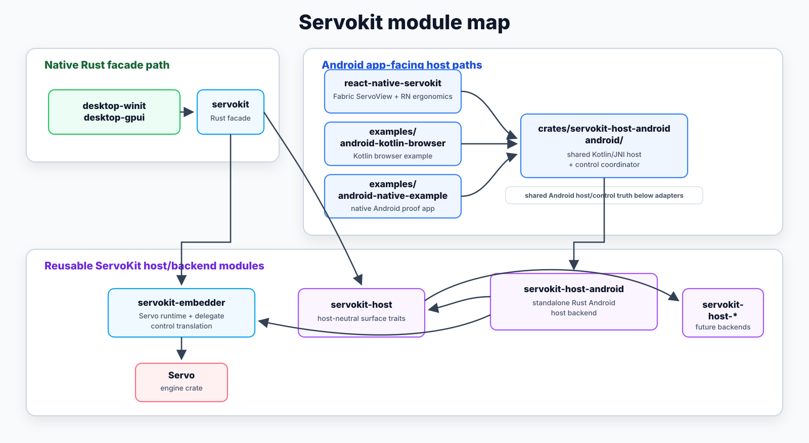
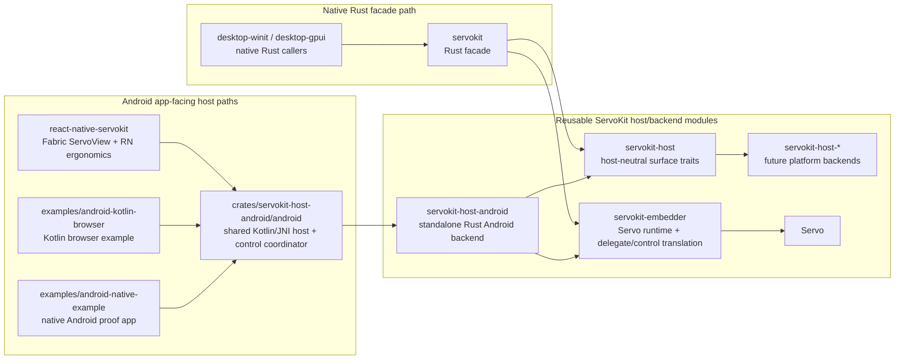

# Runtime and module map

This is the detailed runtime and module-map reference. For the canonical fast
architecture mental model, start with [`../ARCHITECTURE.md`](../ARCHITECTURE.md).

## Current shape

ServoKit is a reusable Rust runtime and thin-adapter toolkit for embedding
Servo: a slim Rust layer over the upstream `servo` crate and servoshell-style
embedding patterns, plus reusable host adapters. It is experimental;
Android/React Native are currently the most mature proof and validation
surfaces. React Native macOS has an experimental AppKit/private-C/Rust
implementation, not a supported or distributed runtime contract. The
architecture is a facade/host-backend split rather than an Android- or React
Native-centered stack. The main runtime paths are:

```text
Native Rust shell/examples -> servokit -> servokit-embedder + servokit-host -> Servo
React Native Android -> react-native-servokit -> crates/servokit-host-android/android -> servokit-host-android -> servokit-embedder -> Servo
Kotlin/native Android examples -> crates/servokit-host-android/android -> servokit-host-android -> servokit-embedder -> Servo
React Native macOS -> react-native-servokit -> AppKit adapter -> package-private desktop C boundary -> servokit-embedder -> Servo
React Native iOS -> react-native-servokit -> portable Rust controller -> UIKit effect adapter -> WKWebView/WebKit
```

React Native defines one Fabric view and mounted command contract. Android and
macOS map it to Servo-backed Rust hosts; iOS maps portable Rust controller
effects to WebKit. The crate-owned Android host Gradle module and Rust Android
backend remain the
canonical Android host-control path.

React Native iOS uses the same app-facing `ServoView` package surface above a
Servo-free portable Rust controller. Rust owns command validation, request
identity, pending semantics, fallback policy, and response validation. Its
Objective-C++ adapter owns the `WKWebView`, native delegate completions and
timers, KVO/recycling, effect execution, engine handles, and main-thread
scheduling. Servo-on-iOS is deferred rather than selected through package build
configuration.

| Layer | Main files | Responsibility |
| --- | --- | --- |
| JS/Fabric surface | `packages/react-native-servokit/src/ServoView.tsx`, `packages/react-native-servokit/src/index.tsx` | Public `ServoView` API and generated Fabric surface contract, with callback names aligned to Servo delegate notifications plus optional RN-owned dialog, context-menu, and navigation-policy handling |
| Android view host | `packages/react-native-servokit/android/src/main/java/org/servo/servokit/reactnative/ServoView.kt`, `ServoViewManager.kt`, `ServoViewportInsetsController.kt` | Own the React Native `ServoView`, mounted Fabric event dispatch, focus, frame scheduling via `Choreographer`, and RN-specific bridge ergonomics |
| Portable controller | `crates/servokit-embedder/src/portable_controller.rs`, `crates/servokit-controller-ffi` | Owns Servo-free command validation, request identity, pending semantics, fallback policy, response validation, and the bounded C boundary packaged for iOS |
| iOS view host | `packages/react-native-servokit/ios/ServoView.mm` | Owns the UIKit/Fabric component, `WKWebView`, WebKit delegates and native completions/timers, KVO/recycling, Rust-effect execution, engine handles, and main-thread scheduling; CocoaPods links WebKit plus the packaged controller XCFramework, not Servo |
| macOS view host | `packages/react-native-servokit/macos/ServoView.mm` | Owns the AppKit/Fabric view, native handles, geometry, input translation, main-queue pumping, and event mapping above the package-private desktop C boundary |
| Reusable Android host module | `crates/servokit-host-android/android/build.gradle`, `src/main/java/.../JniServoHost.kt`, `ServoViewBinding.kt`, `ServoSurfaceLifecycleCoordinator.kt`, `ServoHostEventBridge.kt`, `ServoInputPickerValues.kt` | Crate-owned repo-local Gradle/AAR boundary below Android adapters: packages `libservokit_host_android.so`, owns the proof-only Kotlin/JNI host wrapper, shared host/control coordinator, surface lifecycle helper, picker normalization, and structured event decoding used by the RN adapter and native/Kotlin Android examples |
| Rust host shim | `crates/servokit-host-android/src/lib.rs`, `state.rs`, `android_host.rs`, `token_api.rs` | Android-only compatibility layer that adapts native-window/render-backend vocabulary into the shared `servokit-embedder` runtime, preserves pending navigation until a real surface exists, transports token-scoped controller commands into the shared parser, and isolates the Servo backend from React Native |
| Desktop host boundary | `crates/servokit-host-desktop` | Package-private C interface that lets framework adapters create, attach, command, pump, drain, and destroy a Rust-owned Servo host without moving platform-view ownership into Rust |
| Reusable Servo engine embedder | `crates/servokit-embedder/src/controller_command.rs`, `servo_webview_adapter.rs`, `servo_webview.rs`, `servo_adapter.rs` | Own the shared controller-envelope parser, reusable Servo `WebView` delegate/webview helpers, and Servo-to-Servokit delegate/embedder-control translation for reuse outside the Android host |
| Android Servo host/backend | `crates/servokit-host-android/src/android_backend.rs`, `android_host.rs`, `jni_bridge.rs` | Build and manage the Android `WindowRenderingContext`, native-window/render backend, clipboard, JNI, and platform glue while delegating reusable Servo webview behavior to `servokit-embedder` |
| Toolchain patch | `crates/vendor/tikv-jemalloc-sys` | Remove the obsolete Android `libgcc` link so the Servo shared library links on modern NDKs |

## Runtime flow

1. `ServoView` owns a child `SurfaceView` and forwards `SurfaceHolder` lifecycle events plus Android `MotionEvent` touch input into `ServoViewBinding`.
2. `ServoViewBinding` calls the shared `servokit-android-host` Kotlin/JNI wrapper, which packages `libservokit_host_android.so`, forwards lifecycle/input/controller work into JNI, and drains structured runtime events back into Kotlin through the shared host event bridge.
3. The Rust Android host maps surface lifecycle, browser commands, and host updates into `servokit-embedder::Runtime`; the Android adapter converts the `Surface` into an `ANativeWindow`, creates a Servo rendering context, and builds a `WebView`.
4. `Choreographer` frames call back into Rust `performUpdates()`, which runs the shared runtime update path, spins Servo, paints pending frames, and emits lifecycle events.
5. Kotlin maps the drained events back into React Native Fabric events such as `onUrlChanged`, `onPageTitleChanged`, `onLoadStatusChanged`, `onHistoryChanged`, `onFocusChanged`, `onCursorChanged`, `onFullscreenChanged`, `onCrashed`, and `onError`. Servo delegate-owned policy requests, including `WebViewDelegate::request_navigation`, are surfaced through the same event bridge; React Native-facing policy responses return through the token-scoped controller seam, while touch input stays on the native path.

`examples/android-kotlin-browser` and `examples/android-native-example` enter the
same Android flow at the shared `ServoViewBinding` /
`ServoSurfaceLifecycleCoordinator` layer. They do not load React Native, and they
do not route browser control through React Native.

The Android embedder follows servoshell's mobile defaults by enabling Servo viewport-meta handling and passing Android display density through `WebViewBuilder::hidpi_scale_factor(...)`, so pages render with phone-appropriate scaling instead of desktop-sized layout metrics.

## Engine-specific control ownership

The public React Native API can use the same capability names across engines,
but ownership follows the selected native engine.

On Android and macOS, Rust owns Servo controller identity, command validation,
pending Servo requests, fallback policy, and response validation. Their native
adapters own platform views/handles, input, presentation, and scheduling.

On iOS, the portable Rust controller owns request identity, pending semantics,
fallback policy, and response validation. The WKWebView adapter owns native
delegate completion and timer lifetimes, recycling, engine handles, effect
execution, and main-thread scheduling. Shared React Native callbacks customize
presentation and provide answers; they do not own pending state.

Fallback policy is safe native default first, bounded non-wedging fallback
second, and deny-by-default for risk-sensitive capabilities.

## Target direction

The agreed target direction is ServoKit: a reusable Servo embedding layer where
`react-native-servokit` is one adapter over reusable ServoKit modules. The
target module responsibilities live in
[`docs/servokit.md`](./servokit.md), and the repo-maintained module diagram is
below.

This host-adapter architecture uses the Servokit workspace names while keeping
React Native ergonomics in the RN package. React Native Android,
`examples/android-kotlin-browser`, and `examples/android-native-example` are
sibling app-facing adapters over the same shared Android host/control layer;
React Native is not the canonical Android host-control owner. Desktop and native
Android examples exercise the same seams: `servokit` is the Rust caller facade,
`servokit-embedder` owns reusable Servo webview/delegate behavior, the desktop
`winit` proof owns its app-local window/surface/input plumbing in
`examples/desktop-winit`, the desktop GPUI proof owns its GPUI layout and calls
the Servokit AppKit child-surface helper from `examples/desktop-gpui`, the
reusable `crates/servokit-host-android/android` Gradle module owns the first
shared Android Kotlin/JNI packaging slice below adapters, `servokit-host-android`
owns Android surface and JNI host plumbing in Rust.
Further architecture work should deepen these existing seams rather than add
new target crate names.

In particular, the public ServoKit surface vocabulary (`SurfaceDelegate`,
`NativeChildSurface`, `CpuOffscreenSurface`, `SurfaceTarget`, `SurfaceFrame`)
should remain the facade language, while Android remains a separate
implementation crate rather than being folded into the host-neutral crate.

## Host and example responsibilities

| Area | Responsibility | Stability stance |
| --- | --- | --- |
| `servokit` facade | Repository Rust callers create runtimes, sessions, webviews, surfaces, commands, host-input events, update pumps, and event drains through curated facade modules plus a small root happy path. | Stable enough for repo examples and readiness checks; not yet a semver-stable public SDK. |
| `servokit-embedder` | Reusable Servo delegate/webview integration, portable controller reducer, canonical control payloads, shared command/input/event vocabulary, pure adapter state, and bridge encoding. | Internal reusable core for this repo; API may still move as host traits deepen. |
| `crates/servokit-host-android/android` | Crate-owned reusable repo-local Android Gradle library boundary that packages `libservokit_host_android.so` and holds the first shared Kotlin/JNI host wrapper plus event bridge below adapters. | Proof-only Gradle module; not a stable Kotlin SDK or published Android artifact yet. |
| `servokit-host-android` | Android native-window/render backend, JNI bridge, Choreographer update path, clipboard/input/fallback UI, native library packaging, and the Rust side consumed by the shared Android host module. | Android implementation crate; Kotlin proof-app classes are not stable SDK. |
| `react-native-servokit` | Shared Fabric view API, callbacks/refs, Codegen input, and thin Android, iOS, and macOS native adapters. | React Native package surface remains experimental; generated Codegen glue is consumer-owned. |
| `examples/react-native-macos-app` | React Native macOS verification app for the shared Fabric component, AppKit adapter, package-private desktop C boundary, and ServoKit runtime path. | Exercises an experimental implementation; no supported runtime, binary distribution, or Windows runtime is claimed. |
| `examples/desktop-winit` | Thin desktop app for live rendering through the `servokit` facade, content input, fixture smoke, resize/update pumping, and stdout event tracing. | Proof example, not a production browser shell. |
| `examples/desktop-gpui` | Thin GPUI desktop app that keeps GPUI window/layout ownership while embedding Servo in an AppKit child `NSView` layout slot through `servokit`. | Proof example, not a production GPUI component crate. |
| `examples/android-native-example` | Non-React-Native Android proof app for SurfaceView lifecycle, controls, fixtures, and shared event logs. | Proof app only, not a Kotlin SDK. |
| `examples/android-kotlin-browser` | Kotlin Android browser example over the same shared Android host/control coordinator used below React Native. | Experimental app-facing example, not a stable Kotlin SDK/AAR. |

For durable context, start with [`../README.md`](../README.md),
[`servokit.md`](./servokit.md), and
[`surface-modes.md`](./surface-modes.md), then continue with this overview and
[`readiness-checks.md`](./readiness-checks.md) before using the linked example
README files for platform-specific smoke commands.

## Facade and surface naming conventions

The public `servokit` crate should not mirror the internal crate tree wholesale.
Use namespaced facade modules such as `runtime`, `webview`, `surface`,
`controls`, `events`, `input`, and `host`, and keep root reexports limited to
the common happy path. Canonical Servo-shaped control payloads live once in the
embedder layer and are reexported by the facade when needed.

`Surface` is the preferred rendering/embedding term because upstream Servo and
Surfman already use surfaces for native/window rendering, offscreen rendering,
and texture handoff. The target host callback name is `SurfaceDelegate`, using
CEF/Gecko-style delegate language for app-provided surface callbacks. Avoid
adding a generic `services` module name for this seam.

## Servokit module map

This repo-maintained diagram focuses on the reusable Servo-backed Rust modules
and the shared Android host layer. The portable iOS WebKit path and the macOS
Fabric adapter are described in the runtime paths and ownership tables above;
React Native is not the center of the reusable host/backend model.



The SVG is checked in for docs surfaces that need a concrete image artifact.
The Mermaid block below is the editable source to keep diagram changes
reviewable; update the SVG artifact in the same change whenever this source
changes.



## Ownership rules

- **Rust owns browser and pending embedder-control state on Servo-backed paths.**
- **The portable Rust controller owns iOS command and pending semantics; the
  adapter owns WKWebView and native completion objects.**
- **Android owns unavoidable platform primitives** such as `SurfaceView`, IME plumbing, and lifecycle hooks.
- **React Native should own presentation and answer overrides when possible**, especially for dialogs, context menus, file pickers, and similar embedder features.
- **Low-level runtime behavior should stay close to upstream Servo/servoshell** unless React Native integration requires a deliberate divergence.
- **Native Rust shells should use `servokit` directly.**

## Controller seam

On Android, the current port has two connected handles that refer to the same
Rust `HostHandle`, but they do not have the same lifecycle.

| Handle | Current owner | Current path | Lifecycle role |
| --- | --- | --- | --- |
| **control handle** | React Native ref + Rust controller seam | `packages/react-native-servokit/src/ServoView.tsx` -> Fabric `ServoView` command -> `packages/react-native-servokit/android/src/main/java/org/servo/servokit/reactnative/ServoView.kt` -> `crates/servokit-host-android/android` Kotlin/JNI wrapper -> JNI generic controller command envelope -> shared Rust host state | Browser control identity used for `loadUrl`, `reload`, `goBack`, `goForward`, `focus`, and `blur` |
| **render handle** | Android host | `ServoView` / `ServoViewBinding` -> JNI -> Rust surface attach and frame updates | Binds a real Android surface and drives paint/present lifecycle |

The controller command envelope and generic C/JNI transports are
described in
[`react-native-rust-control-seam.md`](./react-native-rust-control-seam.md).
The mounted React Native `ServoView` carries the same command string to each
native implementation. Android and macOS target Servo-backed controllers; iOS
targets the packaged portable Rust controller.

The first successful Servo construction retains one engine runtime on a
process-long platform UI thread. Servo 0.3.0's handle is `Rc`/non-`Send`, so
ServoKit neither transfers that runtime nor reinitializes it after the owner
thread exits. Controller/WebView state and attached render surfaces have
shorter, independent lifetimes.

For Servo-backed hosts, the important lifecycle rules are:

1. A controller can exist before a render surface is ready.
2. Pending navigation and control commands stay in Rust until a render handle is attached.
3. Surface detach removes the render target, but it does not by itself invalidate the controller.
4. Disposing the host invalidates the control handle, and later token-scoped commands must fail explicitly instead of acting on a recycled pointer.

That makes the current behavior intentionally asymmetric:

- **Servo-backed browser control is on the Rust-owned seam** through the mounted Fabric view-command transport and Rust-owned controller envelope
- **render lifecycle stays Android-owned** because it depends on platform `SurfaceView` state and the UI-thread frame loop
- **React Native-facing and Android-local policy responses both return through the controller seam**, while Android still owns local UI presentation details

Current policy paths:

| Concern | Current path | Direction |
| --- | --- | --- |
| Navigation allow/deny from React Native | React Native callback -> mounted Fabric `sendControllerCommand` view command -> JNI generic controller envelope -> Rust command queue | Active mounted baseline; keep Rust-owned controller semantics |
| JavaScript dialog response from React Native | React Native callback -> mounted Fabric `sendControllerCommand` view command -> JNI generic controller envelope -> Rust command queue | Active mounted baseline; keep Rust-owned controller semantics |
| Context-menu selection or dismissal | Android menu -> mounted `ServoView` generic controller-command helper -> JNI generic controller envelope -> Rust command queue | Active mounted baseline policy resolution path |
| React Native context-menu item injection | React Native callback -> Fabric `showContextMenu` command -> Android menu presentation | Transitional UI handoff only; do not treat it as the portable policy-response path |
| Android-native dialog and navigation fallback behavior | Android host adapter -> mounted `ServoView` generic controller-command helper -> JNI generic controller envelope -> Rust command queue | Platform fallback UI, but still resolved through the Rust-owned controller seam |

The important distinction is that Servo policy decisions that leave the Android
adapter return through the controller seam. Android-local fallback UI may still
present the prompt or menu, but the resolution flows back through the same
Rust-owned envelope rather than shortcutting around it.

The long-term caller paths are:

- **Rust/native desktop examples:** `desktop-winit` / `desktop-gpui` -> `servokit` ->
  `servokit-embedder` + `servokit-host-*`
- **React Native Android mounted path:** `react-native-servokit` ->
  `crates/servokit-host-android/android` -> `servokit-host-android` ->
  `servokit-embedder`
- **Kotlin/native Android host path:** `examples/android-kotlin-browser` or
  `examples/android-native-example` -> `crates/servokit-host-android/android` ->
  `servokit-host-android` -> `servokit-embedder`

Recent Android-specific policy that now lives in this port:

- a real Android `ClipboardManager` bridge for Servo edit actions (`cut`, `copy`, `paste`, `select all`) instead of Servo's Android fallback clipboard string store
- focused-view back-button handling that first dismisses IME, then navigates web history when the embedded page can go back

## Desktop vs mobile

Desktop Rust embedders can look almost entirely Rust-native because crates such as `winit`, `raw-window-handle`, and `surfman` already hide most platform APIs behind Rust interfaces.

Mobile embedding is different. Android still requires real platform framework participation for:

- `Activity` and `View` lifecycle
- `Surface` and render-target ownership
- IME / `InputConnection`
- permissions, intents, and document pickers

That is why this repo keeps native Android glue even though the engine itself is embedded from Rust.

## IME policy

IME is the main example of a feature that is usually safe to keep close to upstream behavior first. App-level tools such as keyboard-aware React Native layout controllers can still customize surrounding UI, but deep web-text-input behavior still depends on the native IME bridge.

The default stance for this repo is:

- keep IME working with upstream-like native behavior
- leave room to add richer control hooks later
- own higher-policy embedder controls in the port rather than delegating them wholesale to upstream support layers

## Clipboard policy

Servo exposes clipboard access through a `ClipboardDelegate`, but on Android the default upstream delegate falls back to an in-process string store. This port now supplies an Android-specific clipboard delegate so context-menu and edit-menu actions use the real platform clipboard.

One platform caveat remains: Android restricts clipboard reads for background apps on newer releases. If the app is not foregrounded when web content requests paste, Android may deny `ClipboardManager` access and the embedder falls back to the most recent clipboard text cached in-process instead of failing the request.
